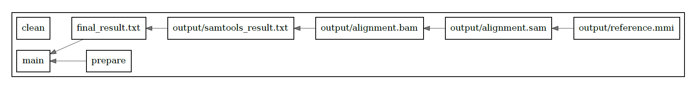

# Assignment #4

## Входные данные
Референс (Escherichia coli): https://www.ncbi.nlm.nih.gov/sra/SRX9196450

Reads: https://www.ncbi.nlm.nih.gov/sra/SRX9196450

Оба этих файла находятся в директории **input**

## Как пользоваться
Для запуска пайплайна достаточно запустить скрипт start.sh:
```bash
./start.sh
```

Также можно запустить пайплайн вызовом мейка:
```bash
make READS="SRR12717711"
```

Для удаления всех сгенерированных файлов (в том числе результатов) можно позвать clean:
```bash
make clean
```

## Пайплайн

Пайплайн был выполнен при помощи GNU make. В большинстве дистрибутивов GNU/Linux установлен по умолчанию.

Основная логика пайплайна находится в Makefile, парсинг результатов samtools flagstat происходит с помощью bash скрипта **parse.sh**

## Результаты

Все интересные результаты находятся в директории **results**
Все промежуточные файлы, генерируемые во время выполнения пайплайна, можно найти в директории **output**.

## Визуализация

Воспользовался следующим инструментом

repo: https://github.com/souring001/makefile-visualizer

Получился такой граф



От графа из слайдов с домашним заданием этот отличается тем, что здесь не изображено условие оценки качества картирования. Связано это с тем, что у меня в Makefile условие - это bash команда, а не make-специфичная конструкция.

А в остальном можно увидеть прямую зависимость файлов друг от друга.